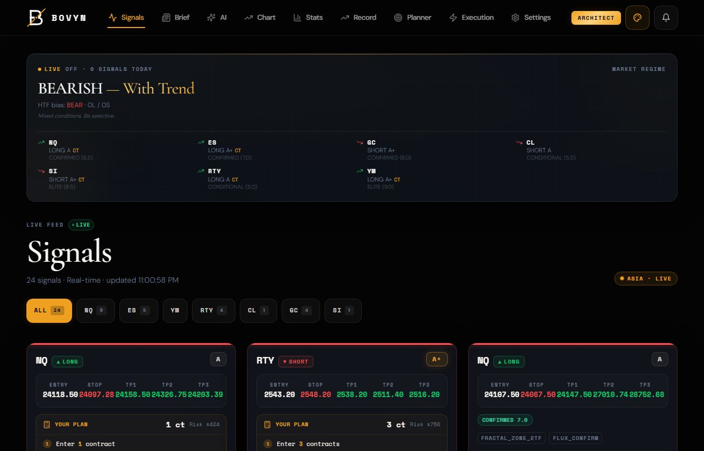
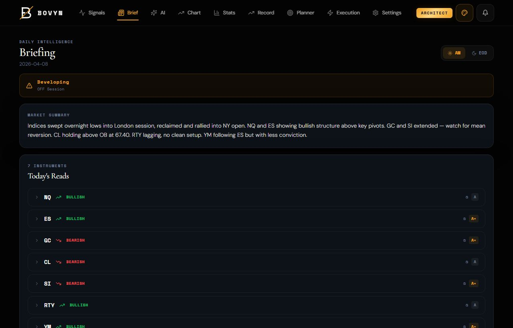
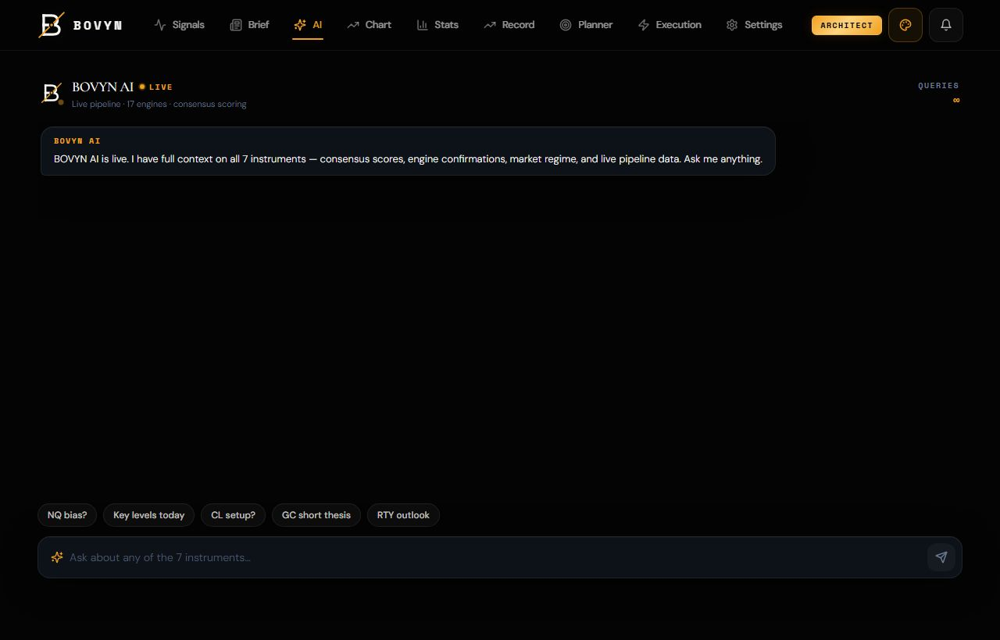
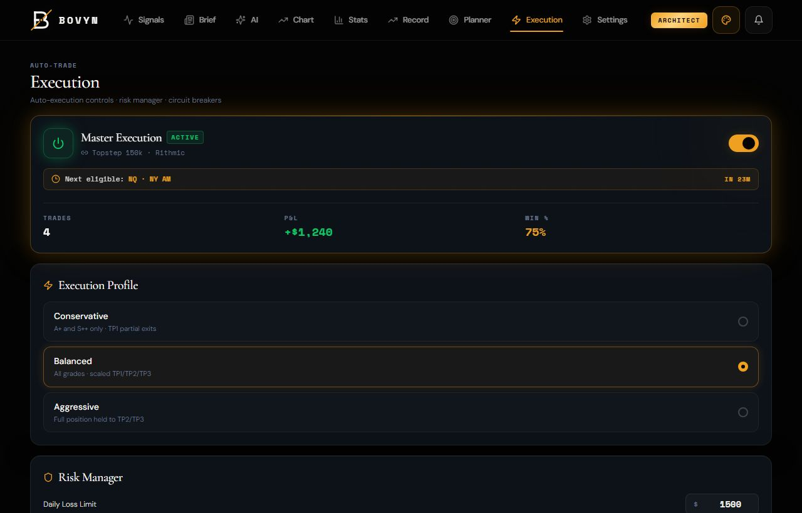
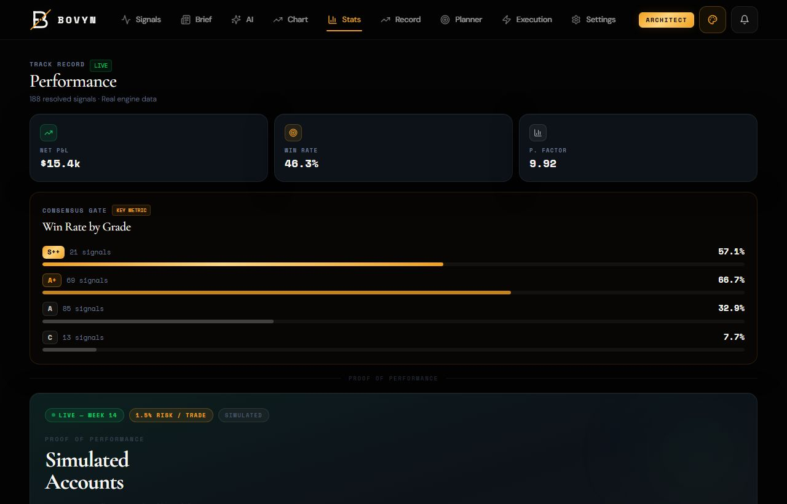

# BOVYN

A futures trading dashboard for the BOVYN signal service. Real-time ICT and fractal trade signals across the major index and commodity futures (NQ, ES, YM, GC, CL), an in-app AI trading assistant, a position-size and risk calculator, a trade journal, and live execution monitoring, all in one operator-style cockpit.

This repository is the **frontend**. It talks to the BOVYN backend API over HTTPS and gates access by subscription tier (Whop OAuth, with an email and password fallback). It installs as a PWA.

## Screenshots

| Live signals | Daily brief | AI assistant |
|---|---|---|
|  |  |  |

| Execution monitor | Stats |
|---|---|
|  |  |

## Features

- **Live signal feed.** ICT/SMC fractal setups streamed per market with entry, stop, targets, and confluence context.
- **Fractal and locked-level charts.** A custom candle chart with fractal structure and key-level overlays.
- **AI assistant.** In-app chat for setup questions, plan reviews, and market context.
- **Position sizer and risk manager.** Contract sizing from account size, risk percent, and stop distance.
- **Trade journal.** Log, tag, and review trades over time.
- **Execution monitor.** Track open positions and fills.
- **Tiered access.** Whop OAuth subscription gating with an email and password fallback and per-tier feature flags.

## Tech

React 18, TypeScript, Vite 5, Tailwind CSS, and `vite-plugin-pwa`. Roughly 15k lines of TypeScript. Component-driven, with hooks for signal streaming, an auth context for tier gating, and a thin typed API client.

## Run locally

```bash
npm install
cp .env.example .env   # then set your values
npm run dev
```

Build for production:

```bash
npm run build
npm run preview
```

## Configuration

See `.env.example`. The app reads its backend URL from `VITE_BOVYN_API_URL` and falls back to the public production API if unset. No secrets are committed to this repository.

## License

MIT. See [LICENSE](LICENSE).
